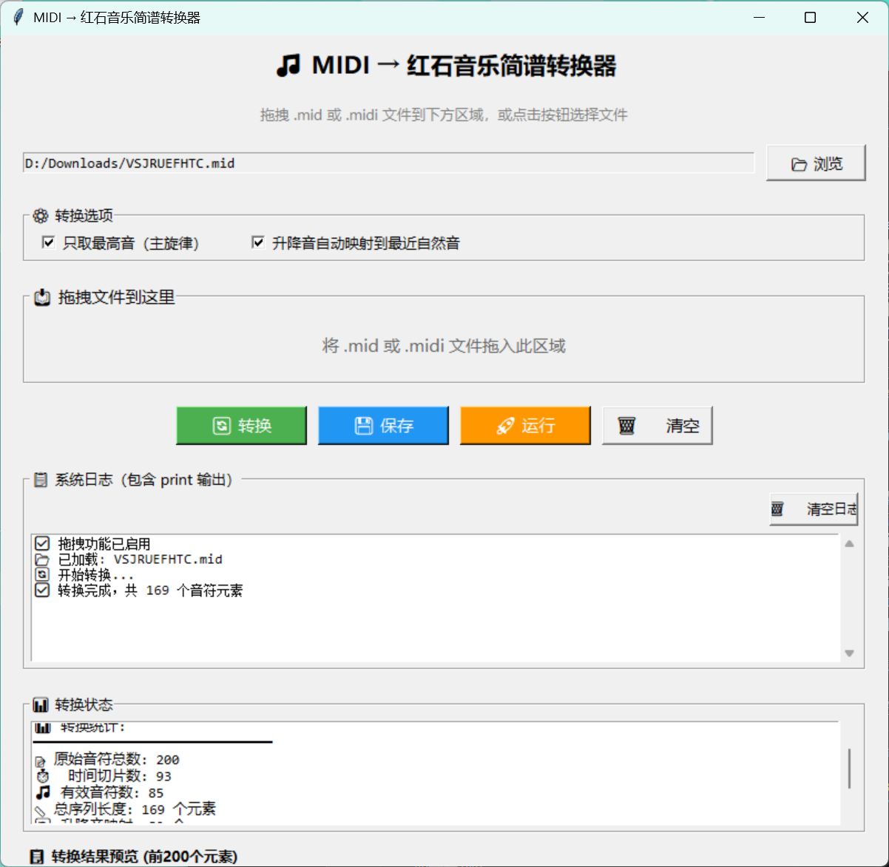

# 🎵 MIDI → 红石音乐简谱转换器
# 🎵 MIDI to Redstone Music Sheet Converter

[](https://www.python.org/downloads/)
[](LICENSE)
[]()

一个将 MIDI 文件转换为《我的世界》红石音乐简谱的图形化工具，支持自动执行音符放置操作。

A graphical tool that converts MIDI files to Minecraft redstone music sheet notation, with automatic note placement execution.

---

## ✨ 功能特点 | Features

- 🎹 **MIDI 解析**：支持 `.mid` 和 `.midi` 格式文件 | **MIDI Parsing**: Supports `.mid` and `.midi` files
- 🎵 **智能转换**：自动将音符映射到红石音乐音阶（低/中/高音区）| **Smart Conversion**: Automatically maps notes to redstone music scales (Low/Mid/High)
- 🔄 **升降音处理**：自动将升降音映射到最近的自然音 | **Accidental Handling**: Automatically maps sharps/flats to nearest natural notes
- 🎯 **主旋律提取**：可选择仅提取最高音（主旋律）| **Melody Extraction**: Option to extract only the highest notes (main melody)
- 🖱️ **拖拽支持**：直接拖拽文件到窗口即可加载 | **Drag & Drop**: Load files by dragging them into the window
- 🚀 **一键运行**：自动在 Minecraft 中执行音符放置 | **One-Click Run**: Automatically executes note placement in Minecraft
- 💾 **导出功能**：将转换结果保存为 Python 文件 | **Export**: Saves conversion results as Python files
- 📋 **实时日志**：显示转换过程和运行状态 | **Real-time Logging**: Displays conversion progress and status

---

## 📸 界面预览 | Screenshot



---

## 🚀 快速开始 | Quick Start

### 环境要求 | Requirements

- Python 3.7 或更高版本 | Python 3.7 or higher
- Windows 7/10/11（推荐）/ Linux / macOS | Windows 7/10/11 (Recommended) / Linux / macOS

### 安装依赖 | Install Dependencies

```bash
# 克隆仓库 | Clone repository
git clone https://github.com/yourusername/midi-to-redstone-music.git
cd midi-to-redstone-music

# 安装依赖 | Install dependencies
pip install -r requirements.txt
运行程序 | Run
bash
python notation_to_MCcommond_GUI_0.01.py
📦 依赖库 | Dependencies
库	用途	必需
mido	MIDI 文件解析 / MIDI file parsing	✅
pydirectinput	Windows 键盘/鼠标模拟 / Windows keyboard/mouse simulation	✅
pynput	键盘状态检测 / Keyboard state detection	✅
pyperclip	剪贴板操作 / Clipboard operations	✅
tkinterdnd2	拖拽功能支持 / Drag & drop support	❌（可选 / Optional）
🎮 使用教程 | User Guide
1. 加载 MIDI 文件 | Load MIDI File
点击 "📂 浏览" 按钮选择文件 | Click "📂 Browse" to select a file

或直接将 .mid/.midi 文件拖入窗口（需安装 tkinterdnd2）| Or drag .mid/.midi files into the window (requires tkinterdnd2)

2. 转换选项 | Conversion Options
只取最高音（主旋律）：勾选后仅提取主旋律，适合复杂的 MIDI 文件 | Extract highest notes only: Extracts only the main melody, ideal for complex MIDI files

升降音自动映射到最近自然音：自动将 #/b 音符映射到最近的自然音阶 | Auto-map sharps/flats: Automatically maps #/b notes to nearest natural notes

3. 转换 | Convert
点击 "🔄 转换" 按钮，查看转换统计和结果预览 | Click "🔄 Convert" to view conversion statistics and preview

4. 在 Minecraft 中运行 | Run in Minecraft
打开 Minecraft 并进入游戏（保持窗口激活）| Open Minecraft and enter the game (keep window active)

点击 "🚀 运行" 按钮 | Click "🚀 Run"

程序会自动执行：| The program will automatically:

开启 Caps Lock（确保英文输入）| Enable Caps Lock (ensure English input)

传送玩家到当前位置（朝向固定）| Teleport player to current position (fixed orientation)

清空背包 | Clear inventory

获取音符盒和红石中继器 | Obtain note blocks and repeaters

按序列放置音符盒 | Place note blocks in sequence

⚠️ 重要提示 | Important Notes：

运行期间请勿操作键盘鼠标 | Do not use keyboard/mouse during execution

确保游戏窗口处于激活状态 | Ensure the game window is active

建议在单人模式或自己的服务器中使用 | Recommended for single-player or your own server

遵守服务器规则，违规使用后果自负 | Follow server rules; user assumes all responsibility

5. 保存结果 | Save Results
点击 "💾 保存" 按钮将转换序列导出为 Python 文件 | Click "💾 Save" to export the sequence as a Python file

📁 输出格式说明 | Output Format
转换后的序列格式示例 | Example of converted sequence:

python
['t1', 'm3', 't1', 'm5', 't1', 'm6', 't1', 'm5']
符号对照表 | Symbol Reference
符号	含义	Minecraft 操作
t1	向前移动 1 格 / Move forward 1 block	/tp ~ ~ ~1 + 右键放置红石中继器 / Right-click to place repeater
l1-l7	低音区 Do-Si / Low octave Do-Si	右键点击音符盒 1-7 次 / Right-click note block 1-7 times
m1-m7	中音区 Do-Si / Mid octave Do-Si	右键点击音符盒 8-14 次 / Right-click note block 8-14 times
h1-h7	高音区 Do-Si / High octave Do-Si	右键点击音符盒 15-21 次 / Right-click note block 15-21 times
音符映射规则 | Note Mapping
音区	MIDI 音符编号	操作
低音区（l）/ Low	48-59	右键点击音符盒 1-7 次 / Right-click 1-7 times
中音区（m）/ Mid	60-71	右键点击音符盒 8-14 次 / Right-click 8-14 times
高音区（h）/ High	72-83	右键点击音符盒 15-21 次 / Right-click 15-21 times
🔧 自定义配置 | Custom Configuration
调整时间精度 | Adjust Time Precision
在 midi_to_sequence 函数中修改 | Modify in midi_to_sequence:

python
time_key = round(seconds, 0.5)  # 改为 0.5 秒精度 / Change to 0.5s precision
自定义音阶映射 | Custom Scale Mapping
修改 WHITE_KEYS 和 WHITE_KEY_MAP 字典 | Modify WHITE_KEYS and WHITE_KEY_MAP:

python
WHITE_KEYS = [0, 2, 4, 5, 7, 9, 11]
WHITE_KEY_MAP = {0: '1', 2: '2', 4: '3', 5: '4', 7: '5', 9: '6', 11: '7'}
🌍 跨平台支持 | Cross-Platform Support
Windows（✅ 完全支持 / Fully Supported）
所有功能均可正常使用 | All features work normally.

Linux（⚠️ 有限支持 / Limited Support）
需要替换输入模拟库 | Requires replacing input simulation library:

bash
sudo apt-get install scrot
pip install pyautogui
macOS（⚠️ 有限支持 / Limited Support）
需要授予辅助功能权限 | Requires accessibility permissions:

bash
# 系统偏好设置 → 安全性与隐私 → 隐私 → 辅助功能
# System Preferences → Security & Privacy → Privacy → Accessibility
pip install pyautogui
🐛 常见问题 | FAQ
Q: 程序运行后没有反应？| Program doesn't respond after running?
A: 确保：| Ensure:

Minecraft 窗口处于激活状态 | Minecraft window is active

已开启 Caps Lock（代码会尝试自动开启）| Caps Lock is on (code attempts to enable automatically)

Q: 转换后音符数量为 0？| Zero notes after conversion?
A: 检查：| Check:

MIDI 文件是否包含有效音符 | MIDI file contains valid notes

尝试取消"只取最高音"选项 | Try disabling "Extract highest notes only"

音符音高是否在支持范围内（48-83）| Note pitch is within supported range (48-83)

Q: 拖拽功能无效？| Drag & drop not working?
A: 安装 tkinterdnd2 | Install tkinterdnd2:

bash
pip install tkinterdnd2
Q: Linux/macOS 上运行报错？| Errors on Linux/macOS?
A: 参考跨平台支持章节进行适配 | Refer to Cross-Platform Support section.

🤝 贡献指南 | Contributing
欢迎提交 Issue 和 Pull Request！| Issues and Pull Requests are welcome!

Fork 本仓库 | Fork this repository

创建特性分支 | Create a feature branch (git checkout -b feature/AmazingFeature)

提交更改 | Commit changes (git commit -m 'Add some AmazingFeature')

推送到分支 | Push to branch (git push origin feature/AmazingFeature)

打开 Pull Request | Open a Pull Request

📄 许可证 | License
本项目采用 GNU General Public License v2.0 - 详见 LICENSE 文件

This project is licensed under the GNU General Public License v2.0 - see the LICENSE file for details.

简单来说 | In short:

✅ 你可以自由使用、修改、分发本软件 | You can freely use, modify, and distribute this software

✅ 你可以将本软件用于商业目的 | You can use this software for commercial purposes

⚠️ 修改后的版本也必须以 GPL v2 开源 | Modified versions must also be open-sourced under GPL v2

⚠️ 必须保留原始版权声明 | Original copyright notice must be retained

❌ 不提供任何担保，使用风险自负 | No warranty provided; use at your own risk

⚠️ 免责声明 | Disclaimer
本工具仅供学习和娱乐用途。使用本工具在 Minecraft 服务器中自动操作时，请遵守服务器规则。因违规使用、服务器封禁等造成的后果由使用者自行承担。

This tool is for educational and entertainment purposes only. When using this tool to automate actions in Minecraft servers, please follow server rules. The user assumes all responsibility for any consequences, including server bans or penalties.

🙏 致谢 | Acknowledgements
mido - MIDI 文件处理库 / MIDI file processing library

pydirectinput - Windows 输入模拟库 / Windows input simulation library

tkinterdnd2 - 拖拽功能支持 / Drag & drop support

pynput - 键盘控制库 / Keyboard control library

pyperclip - 剪贴板操作库 / Clipboard operations library

Made with ❤️ for Minecraft Music Lovers